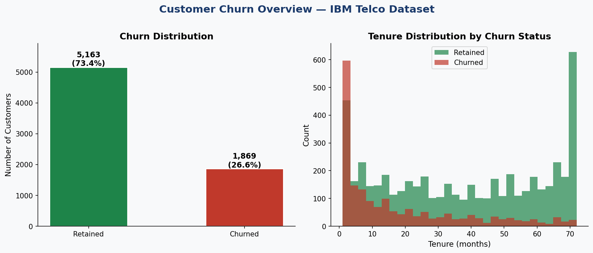
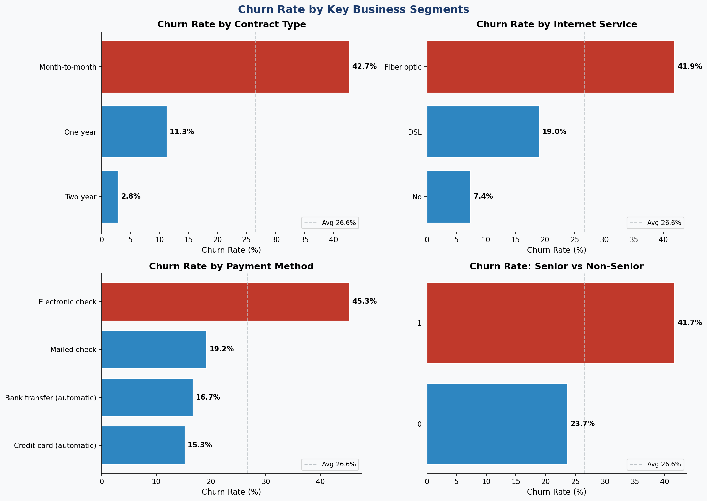
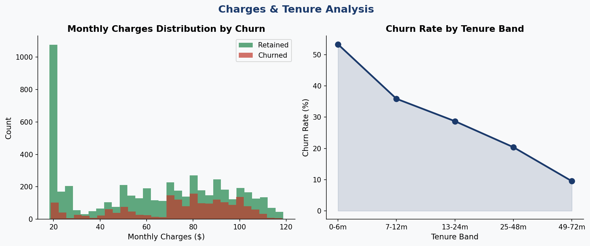
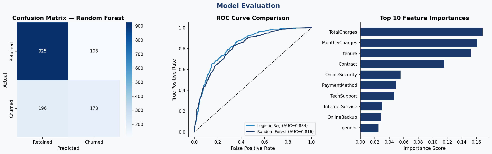

# Customer Churn Analysis — IBM Telco Dataset

[](https://roshanshaik0337.github.io/customer-churn-analysis/dashboard.html)
[](https://python.org)
[](https://scikit-learn.org)
[](https://mysql.com)

**Author:** Shaik Roshan Basha &nbsp;|&nbsp; **Dataset:** IBM Telco Customer Churn (7,032 records)

---

## Overview

An end-to-end data analytics project that identifies the key drivers of customer churn in a telecom company and builds a machine learning model to predict at-risk customers.

**Business Problem:** The company is losing 26.6% of customers annually. Leadership needs to understand *why* customers leave and *which* customers are most at risk — so the retention team can act before it's too late.

**Deliverables:** EDA charts · SQL analysis · ML churn prediction model · Interactive browser dashboard · Business recommendations

---

## Live Dashboard

> 📊 [Open the interactive dashboard →](https://roshanshaik0337.github.io/customer-churn-analysis/dashboard.html)

| Churn Overview | Segment Analysis |
|---|---|
|  |  |

| Charges & Tenure | Model Evaluation |
|---|---|
|  |  |

---

## Key Metrics

| Metric | Value |
|---|---|
| Total Customers | 7,032 |
| Churned | 1,869 (26.6%) |
| Retained | 5,163 (73.4%) |
| Avg Monthly Charge | $64.80 |
| Avg Tenure | 32.4 months |
| Best Model AUC | 0.834 (Logistic Regression) |

---

## Key Findings

| Segment | Churn Rate | vs Avg (26.6%) |
|---|---|---|
| Month-to-month contract | 42.7% | +16.1 pts |
| Electronic check payment | 45.3% | +18.7 pts |
| Fiber optic internet | 41.9% | +15.3 pts |
| New customers (0–6 months) | 53.3% | +26.7 pts |
| Loyal customers (49+ months) | 9.5% | −17.1 pts |

---

## Business Recommendations

**R1 — Contract Conversion Campaign**
Offer 15–20% discount to month-to-month customers who upgrade to annual contracts. If 30% convert, estimated churn reduction of 18–22%.

**R2 — Fiber Optic Quality Review**
Deploy an NPS survey exclusively to Fiber optic users. Fast-track top complaints with a 60-day SLA improvement target.

**R3 — Auto-Pay Incentive**
Offer $5/month discount for switching from Electronic check to bank transfer or credit card. Directly targets the highest-churn payment segment (45.3%).

**R4 — 90-Day Onboarding Program**
Proactive check-ins at day 7, 30, and 90 for new customers — addressing the critical 53.3% churn rate in the first 6 months.

---

## ML Model Results

| Model | Accuracy | AUC-ROC |
|---|---|---|
| **Logistic Regression** | **72.6%** | **0.834 ✓ Best** |
| Random Forest | 78.4% | 0.816 |

**Top predictors:** Monthly Charges · Tenure · Total Charges · Contract Type · Internet Service

> Logistic Regression wins on AUC (better at ranking at-risk customers), while Random Forest has higher raw accuracy. For churn prediction, AUC is the more meaningful metric.

---

## Project Structure

```
customer-churn-analysis/
│
├── data/
│   └── telco_churn.csv             # IBM Telco dataset (7,032 records)
│
├── scripts/
│   ├── churn_analysis.py           # EDA + preprocessing + ML pipeline
│   └── churn_queries.sql           # 12 analytical SQL queries
│
├── outputs/
│   ├── 01_churn_overview.png       # Churn distribution + tenure histogram
│   ├── 02_churn_by_segments.png    # Churn by contract, internet, payment, age
│   ├── 03_charges_tenure.png       # Monthly charges + tenure band analysis
│   ├── 04_model_evaluation.png     # Confusion matrix, ROC curve, feature importance
│   ├── summary_stats.json          # Key metrics
│   └── chart_data.json             # Segment-level churn rates
│
├── dashboard.html                  # Interactive browser dashboard
├── requirements.txt                # Python dependencies
└── README.md
```

---

## Tech Stack

| Layer | Tool | Purpose |
|---|---|---|
| EDA & Preprocessing | Python · pandas · NumPy · Matplotlib · Seaborn | Data exploration, cleaning, visualisation |
| Machine Learning | scikit-learn | Logistic Regression + Random Forest churn model |
| SQL Analysis | MySQL | Aggregations, segmentation, window functions |
| Dashboard | HTML + Chart.js | Interactive browser dashboard |
| Version Control | Git + GitHub Pages | Hosting + project management |

---

## How to Run

```bash
# 1. Clone the repo
git clone https://github.com/RoshanShaik0337/customer-churn-analysis.git
cd customer-churn-analysis

# 2. Install dependencies
pip install -r requirements.txt

# 3. Add the dataset
# Download WA_Fn-UseC_-Telco-Customer-Churn.csv from Kaggle
# and place it in the data/ folder as telco_churn.csv

# 4. Run the analysis
cd scripts
python churn_analysis.py
# Outputs (PNGs + JSON) will be saved to /outputs/

# 5. View the dashboard
# Open dashboard.html in any browser
# or visit: https://roshanshaik0337.github.io/customer-churn-analysis/dashboard.html

# 6. Run SQL queries
# Import telco_churn.csv into MySQL, then run churn_queries.sql
```

---

## Dataset

Source: [IBM Telco Customer Churn](https://www.kaggle.com/blastchar/telco-customer-churn) on Kaggle.
11 rows with blank `TotalCharges` were dropped during cleaning, leaving 7,032 usable records.

**Key columns:** `customerID` · `gender` · `SeniorCitizen` · `tenure` · `Contract` · `InternetService` · `PaymentMethod` · `MonthlyCharges` · `TotalCharges` · `Churn`

---

## Skills Demonstrated

- Exploratory Data Analysis (EDA) with Python
- Data cleaning and feature engineering
- SQL aggregations, CTEs, and window functions
- Binary classification — Logistic Regression and Random Forest
- Model evaluation — confusion matrix, ROC-AUC, classification report
- Interactive dashboard design with Chart.js
- Translating analytical findings into business recommendations
